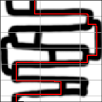
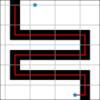
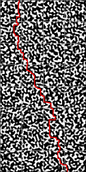
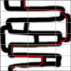
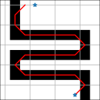
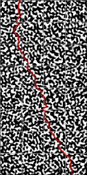

# Shortes path on a height map

It is given a height map $w(x,y)$ which is represented as 2-dimensional array of type `uint8`. The algorithm finds the curve $\gamma(y)$ which minimizes the cost function
$$
l\left[\gamma\right]=w\left(\gamma\left(0\right),0\right)+\sum_{y=1}^{N-1}\left(1+\sum_{x=\gamma\left(y-1\right)}^{\gamma\left(y\right)}w\left(x,y\right)+1\right),
$$
i.e. the sum of all the pixels of the height map $w$ the curve goes through plus its length. 

Optionally, an initial and final points can be fixed: $\gamma(0) = x_0, \gamma(N-1) = x_f$. Otherwise, the algorithm finds shortest curve which connects the top side of the image and its bottom.

# Examples

1. The shortest path with free ends 

    

2. The shortest path with fixed ends

    

3. The shortest path for randomly generated image

    

4. The shortest path with free ends when diagonal connections allowed

    

5. The shortest path with fixed ends when diagonal connections allowed

    

6. The shortest path for randomly generated image when diagonal connections allowed

    
